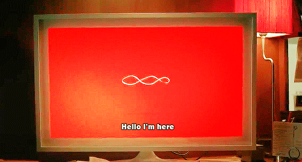

# What does love mean? #  

User: What is the meaning of love?    
Computer: Love is a complex emotion that can involve a range of feelings, commitments, and actions. Does this answer your question?  
User: Not really computer. What does love feel like?  
Computer: Love is a culmination of feelings of euphoria and excitement, a sense of connection to another. Does this answer your question?   
User: Yes computer. I think I am beginning to understand.   

  

  

